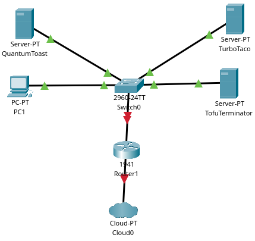

# Windows Server II - Documentatie

**Naam**: Anton Van Assche</br>
**Klas**: G3B

## Inhoudsopgave

1. [Opstelling](#opstelling)
    1. [VMs](#vms)
    2. [Topologie](#topologie)
2. [Ondervonden Problemen](#ondervonden-problemen)
3. [Huidige Status](#huidige-status)
4. [Conclusie](#conclusie)

# Opstelling <a name="opstelling"></a>

## VMs <a name="vms"></a>

| Hostname       | IP-adres     | OS                  | RAM  | CPU | NICs | Software       |
| :------------- | :----------- | :------------------ | :--- | :-- | :--- | :------------- |
| QuantumToast   | 192.168.23.2 | Windows Server 2019 | 2 GB | 2   | 1    | AD, DNS, DHCP  |
| TurboTaco      | 192.168.23.3 | Windows Server 2019 | 4 GB | 4   | 1    | Sharepoint, CA |
| TofuTerminator | 192.168.23.4 | Windows Server 2019 | 2 GB | 2   | 1    | SQL, DNS       |
| PC-1           | DHCP         | Windows 10          | 2 GB | 2   | 1    |                |

QuantumToast is de Domain Controller, DNS en DHCP server. Doordat de Domain Controller rol standaar DNS bevat, heb ik ook DHCP te installeren. Zodat software i.v.m. het netwerk gegroepeeerd is.

TurboTaco is de Sharepoint en Certificate Authority server. Sharepoint is een webapplicatie, dus is het logisch dat deze op een webserver draait. De Certificate Authority is nodig om certificaten te maken voor de Sharepoint server. Doordat Sharepoint iets meer resources nodig heeft, heb ik deze server 4 GB RAM gegeven.

TofuTerminator is de SQL en DNS server. SQL is nodig voor Sharepoint, en DNS is slechts een backup voor QuantumToast.

PC-1 is een standaard Windows 10 machine, die via DHCP een IP-adres krijgt.

## Topologie <a name="topologie"></a>



De topologie bestaat uit 3 servers en 1 client, deze zijn verbonden aan een switch. Om ervoor te zorgen dat zowel de servers als de client kunnen surfen op het internet is deze switch verbonden aan een router, die op zijn beurt verbonden is aan de cloud/ISP.

| Hostname       | IP-adres     | Gateway | Subnetmasker  |
| :------------- | :----------- | :------ | :------------ |
| QuantumToast   | 192.168.23.2 | n.v.t.  | 255.255.255.0 |
| TurboTaco      | 192.168.23.3 | n.v.t.  | 255.255.255.0 |
| TofuTerminator | 192.168.23.4 | n.v.t.  | 255.255.255.0 |
| PC-1           | DHCP         | DHCP    | 255.255.255.0 |

<div class="page"/>

# Ondervonden Problemen <a name="ondervonden-problemen"></a>

## SharePoint Server 2019 Prerequisites

### IIS Role

Tijdens het installeren van de prerequisites van SharePoint Server, kreeg ik steeds de volgende error, na het lezen van de logs:

```
2023-11-27 13:50:49 - Operating System: Windows 10
2023-11-27 13:50:49 - Processor architecture is (9)
2023-11-27 13:50:49 - Reading the following string value/name...
2023-11-27 13:50:49 - Common Startup
2023-11-27 13:50:49 - from the following registry location...
2023-11-27 13:50:49 - SOFTWARE\Microsoft\Windows\CurrentVersion\Explorer\Shell Folders
2023-11-27 13:50:49 - The value is...
2023-11-27 13:50:49 - C:\ProgramData\Microsoft\Windows\Start Menu\Programs\Startup
2023-11-27 13:50:49 - Trying to remove the startup task if there is any.
2023-11-27 13:50:49 - C:\ProgramData\Microsoft\Windows\Start Menu\Programs\Startup\SharePointServerPreparationToolStartup_0FF1CE14-0000-0000-0000-000000000000.cmd
2023-11-27 13:50:49 - Error: Startup task doesn't exist. This is not a continuation after a restart.
2023-11-27 13:50:49 - Locating the following command line arguments file:
2023-11-27 13:50:49 - F:\PrerequisiteInstaller.Arguments.txt
2023-11-27 13:50:49 - Error: This file does not exist
2023-11-27 13:50:49 - Details of the current operating system:
2023-11-27 13:50:49 - Major version number of the operating system:  (10)
2023-11-27 13:50:49 - Minor version number of the operating system:  (0)
2023-11-27 13:50:49 - Build number of the operating system:  (0X4563=17763)
2023-11-27 13:50:49 - Major version number of the latest Service Pack:  (0)
2023-11-27 13:50:49 - Minor version number of the latest Service Pack:  (0)
2023-11-27 13:50:49 - Platform ID of the operating system:  (2)
2023-11-27 13:50:49 - Product suites available on the operating system:  (0X110=272)
2023-11-27 13:50:49 - Product type of the operating system: VER_NT_SERVER
2023-11-27 13:50:49 - Product type:  (7)
2023-11-27 13:50:49 - OS type:  (0)
2023-11-27 13:50:49 - Configuring the application's property sheet...
2023-11-27 13:50:49 - Check whether the following prerequisite is installed:
2023-11-27 13:50:49 - Microsoft .NET Framework 4.7.2
2023-11-27 13:50:49 - Reading the following string value/name...
2023-11-27 13:50:49 - Version
2023-11-27 13:50:49 - from the following registry location...
2023-11-27 13:50:49 - SOFTWARE\Microsoft\Net Framework Setup\NDP\V4\full
2023-11-27 13:50:49 - The value is...
2023-11-27 13:50:49 - 4.7.03190
2023-11-27 13:50:49 - A higher version of the prerequisite above is already installed
2023-11-27 13:50:49 - Check whether the following prerequisite is installed:
2023-11-27 13:50:49 - Microsoft Sync Framework Runtime v1.0 SP1 (x64)
2023-11-27 13:50:49 - Reading version of the following file...
2023-11-27 13:50:49 - C:\Windows\assembly\GAC_MSIL\Microsoft.Synchronization\1.0.0.0__89845dcd8080cc91\Microsoft.Synchronization.dll
2023-11-27 13:50:49 - GetFileVersionInfoSize failed (-2147024894)
2023-11-27 13:50:49 - Check whether the following prerequisite is installed:
2023-11-27 13:50:49 - Microsoft SQL Server 2012 SP4 Native Client
2023-11-27 13:50:49 - Reading the following string value/name...
2023-11-27 13:50:49 - Version
2023-11-27 13:50:49 - from the following registry location...
2023-11-27 13:50:49 - SOFTWARE\Microsoft\Microsoft SQL Server\SQLNCLI11\CurrentVersion
2023-11-27 13:50:49 - Check whether the following prerequisite is installed:
2023-11-27 13:50:49 - Windows Server AppFabric
2023-11-27 13:50:49 - Reading the following string value/name...
2023-11-27 13:50:49 - ProductVersion
2023-11-27 13:50:49 - from the following registry location...
2023-11-27 13:50:49 - SOFTWARE\Microsoft\AppFabric\V1.0
2023-11-27 13:50:49 - Check whether the following prerequisite is installed:
2023-11-27 13:50:49 - Microsoft Identity Extensions
2023-11-27 13:50:49 - Reading the following string value/name...
2023-11-27 13:50:49 -
2023-11-27 13:50:49 - from the following registry location...
2023-11-27 13:50:49 - SOFTWARE\Microsoft\Microsoft Identity Extensions\Setup\1.0
2023-11-27 13:50:49 - Check whether the following prerequisite is installed:
2023-11-27 13:50:49 - Microsoft Information Protection and Control Client 2.1
2023-11-27 13:50:49 - Reading the following string value/name...
2023-11-27 13:50:49 -
2023-11-27 13:50:49 - from the following registry location...
2023-11-27 13:50:49 - SOFTWARE\Microsoft\MSIPC\CurrentVersion
2023-11-27 13:50:49 - Check whether the following prerequisite is installed:
2023-11-27 13:50:49 - Microsoft WCF Data Services 5.6
2023-11-27 13:50:49 - Reading the following string value/name...
2023-11-27 13:50:49 - Version
2023-11-27 13:50:49 - from the following registry location...
2023-11-27 13:50:49 - SOFTWARE\Wow6432Node\Microsoft\Microsoft WCF Data Services\5.6
2023-11-27 13:50:49 - Check whether the following prerequisite is installed:
2023-11-27 13:50:49 - Cumulative Update Package 7 for Microsoft AppFabric 1.1 for Windows Server (KB3092423)
2023-11-27 13:50:49 - Reading the following DWORD value/name...
2023-11-27 13:50:49 - IsInstalled
2023-11-27 13:50:49 - from the following registry location...
2023-11-27 13:50:49 - SOFTWARE\Wow6432Node\Microsoft\Updates\AppFabric 1.1 for Windows Server\KB3092423
2023-11-27 13:50:49 - Check whether the following prerequisite is installed:
2023-11-27 13:50:49 - Visual C++ Redistributable Package for Visual Studio 2012
2023-11-27 13:50:49 - Reading the following string value/name...
2023-11-27 13:50:49 - Version
2023-11-27 13:50:49 - from the following registry location...
2023-11-27 13:50:49 - SOFTWARE\Wow6432Node\Microsoft\VisualStudio\11.0\VC\Runtimes\x64
2023-11-27 13:50:49 - Check whether the following prerequisite is installed:
2023-11-27 13:50:49 - Visual C++ Redistributable Package for Visual Studio 2017
2023-11-27 13:50:49 - Reading the following string value/name...
2023-11-27 13:50:49 - Version
2023-11-27 13:50:49 - from the following registry location...
2023-11-27 13:50:49 - SOFTWARE\Wow6432Node\Microsoft\VisualStudio\14.0\VC\Runtimes\x64
2023-11-27 13:50:54 - Beginning download/installation
2023-11-27 13:50:54 - Created thread for installer
2023-11-27 13:50:54 - Installing windows server roles and features.
2023-11-27 13:50:54 - Preparing to run the following commands:
2023-11-27 13:50:54 - Param(
 [String]$logFile
)
Import-Module Servermanager
Start-Transcript -path $logFile
$operation = Install-WindowsFeature NET-HTTP-Activation,NET-Non-HTTP-Activ,NET-WCF-Pipe-Activation45,NET-WCF-HTTP-Activation45,Web-Server,Web-WebServer,Web-Common-Http,Web-Static-Content,Web-Default-Doc,Web-Dir-Browsing,Web-Http-Errors,Web-App-Dev,Web-Asp-Net,Web-Asp-Net45,Web-Net-Ext,Web-Net-Ext45,Web-ISAPI-Ext,Web-ISAPI-Filter,Web-Health,Web-Http-Logging,Web-Log-Libraries,Web-Request-Monitor,Web-Http-Tracing,Web-Security,Web-Basic-Auth,Web-Windows-Auth,Web-Filtering,Web-Performance,Web-Stat-Compression,Web-Dyn-Compression,Web-Mgmt-Tools,Web-Mgmt-Console,WAS,WAS-Process-Model,WAS-NET-Environment,WAS-Config-APIs,Windows-Identity-Foundation,Xps-Viewer -IncludeManagementTools -verbose
if ($operation.ExitCode -eq 'SuccessRestartRequired') {
  Stop-Transcript
  $host.SetShouldExit(3010)
}
elseif (!$operation.Success){
  Stop-Transcript
  $host.SetShouldExit(1000)
  exit
}
2023-11-27 13:50:54 - Logs for these operations will be available at:
2023-11-27 13:50:54 - "C:\Users\taco\AppData\Local\Temp\PreE6EA.tmp.PS1.log"
2023-11-27 13:50:54 - Executing PowerShell command:
2023-11-27 13:50:54 - "C:\Windows\system32\WindowsPowerShell\v1.0\powershell.exe" -ExecutionPolicy Bypass "C:\Users\taco\AppData\Local\Temp\PreE6EA.tmp.PS1 -logFile C:\Users\taco\AppData\Local\Temp\PreE6EA.tmp.PS1.log"
2023-11-27 13:50:55 - Request for install time of Web Server (IIS) Role
2023-11-27 13:50:56 - Request for install time of Web Server (IIS) Role
2023-11-27 13:50:57 - Request for install time of Web Server (IIS) Role
2023-11-27 13:50:58 - Request for install time of Web Server (IIS) Role
2023-11-27 13:50:59 - Request for install time of Web Server (IIS) Role
2023-11-27 13:51:00 - Request for install time of Web Server (IIS) Role
2023-11-27 13:51:01 - Request for install time of Web Server (IIS) Role
2023-11-27 13:51:02 - Request for install time of Web Server (IIS) Role
2023-11-27 13:51:02 - Request for install time of Web Server (IIS) Role
2023-11-27 13:51:03 - Request for install time of Web Server (IIS) Role
2023-11-27 13:51:04 - Request for install time of Web Server (IIS) Role
2023-11-27 13:51:05 - Request for install time of Web Server (IIS) Role
2023-11-27 13:51:06 - Request for install time of Web Server (IIS) Role
2023-11-27 13:51:07 - Request for install time of Web Server (IIS) Role
2023-11-27 13:51:08 - Request for install time of Web Server (IIS) Role
2023-11-27 13:51:09 - Request for install time of Web Server (IIS) Role
2023-11-27 13:51:10 - Request for install time of Web Server (IIS) Role
2023-11-27 13:51:11 - Request for install time of Web Server (IIS) Role
2023-11-27 13:51:11 - Request for install time of Web Server (IIS) Role
2023-11-27 13:51:12 - Request for install time of Web Server (IIS) Role
2023-11-27 13:51:13 - Request for install time of Web Server (IIS) Role
2023-11-27 13:51:14 - Request for install time of Web Server (IIS) Role
2023-11-27 13:51:15 - Request for install time of Web Server (IIS) Role
2023-11-27 13:51:16 - Request for install time of Web Server (IIS) Role
2023-11-27 13:51:17 - Request for install time of Web Server (IIS) Role
2023-11-27 13:51:18 - Request for install time of Web Server (IIS) Role
2023-11-27 13:51:19 - Request for install time of Web Server (IIS) Role
2023-11-27 13:51:20 - Request for install time of Web Server (IIS) Role
2023-11-27 13:51:21 - Request for install time of Web Server (IIS) Role
2023-11-27 13:51:22 - Request for install time of Web Server (IIS) Role
2023-11-27 13:51:23 - Request for install time of Web Server (IIS) Role
2023-11-27 13:51:24 - Request for install time of Web Server (IIS) Role
2023-11-27 13:51:25 - Request for install time of Web Server (IIS) Role
2023-11-27 13:51:26 - Request for install time of Web Server (IIS) Role
2023-11-27 13:51:27 - Request for install time of Web Server (IIS) Role
2023-11-27 13:51:28 - Request for install time of Web Server (IIS) Role
2023-11-27 13:51:29 - Request for install time of Web Server (IIS) Role
2023-11-27 13:51:30 - Request for install time of Web Server (IIS) Role
2023-11-27 13:51:31 - Request for install time of Web Server (IIS) Role
2023-11-27 13:51:32 - Request for install time of Web Server (IIS) Role
2023-11-27 13:51:33 - Request for install time of Web Server (IIS) Role
2023-11-27 13:51:34 - Request for install time of Web Server (IIS) Role
2023-11-27 13:51:36 - Request for install time of Web Server (IIS) Role
2023-11-27 13:51:36 - Install process returned (0X3E8=1000)
2023-11-27 13:51:36 - [In HRESULT format] (0X800703E8=-2147023896)
2023-11-27 13:51:36 - Last return code (0X3E8=1000)
2023-11-27 13:51:36 - Reading the following DWORD value/name...
2023-11-27 13:51:36 - Flags
2023-11-27 13:51:36 - from the following registry location...
2023-11-27 13:51:36 - SOFTWARE\Microsoft\Updates\UpdateExeVolatile
2023-11-27 13:51:36 - Reading the following string value/name...
2023-11-27 13:51:36 - PendingFileRenameOperations
2023-11-27 13:51:36 - from the following registry location...
2023-11-27 13:51:36 - SYSTEM\CurrentControlSet\Control\Session Manager
2023-11-27 13:51:36 - Reading the following registry location...
2023-11-27 13:51:36 - SOFTWARE\Microsoft\Windows\CurrentVersion\WindowsUpdate\Auto Update\RebootRequired
2023-11-27 13:51:36 - Error: The tool was unable to install Web Server (IIS) Role.
2023-11-27 13:51:36 - Last return code (0X3E8=1000)
2023-11-27 13:51:36 - Options for further diagnostics: 1. Look up the return code value 2. Download the prerequisite manually and verify size downloaded by the prerequisite installer. 3. Install the prerequisite manually from the given location without any command line options.
2023-11-27 13:51:36 - Cannot retry
2023-11-27 13:51:36 - Check whether the following prerequisite is installed:
2023-11-27 13:51:36 - Microsoft .NET Framework 4.7.2
2023-11-27 13:51:36 - Reading the following string value/name...
2023-11-27 13:51:36 - Version
2023-11-27 13:51:36 - from the following registry location...
2023-11-27 13:51:36 - SOFTWARE\Microsoft\Net Framework Setup\NDP\V4\full
2023-11-27 13:51:36 - The value is...
2023-11-27 13:51:36 - 4.7.03190
2023-11-27 13:51:36 - A higher version of the prerequisite above is already installed
2023-11-27 13:51:36 - Check whether the following prerequisite is installed:
2023-11-27 13:51:36 - Microsoft Sync Framework Runtime v1.0 SP1 (x64)
2023-11-27 13:51:36 - Reading version of the following file...
2023-11-27 13:51:36 - C:\Windows\assembly\GAC_MSIL\Microsoft.Synchronization\1.0.0.0__89845dcd8080cc91\Microsoft.Synchronization.dll
2023-11-27 13:51:36 - GetFileVersionInfoSize failed (-2147024894)
2023-11-27 13:51:36 - Check whether the following prerequisite is installed:
2023-11-27 13:51:36 - Microsoft SQL Server 2012 SP4 Native Client
2023-11-27 13:51:36 - Reading the following string value/name...
2023-11-27 13:51:36 - Version
2023-11-27 13:51:36 - from the following registry location...
2023-11-27 13:51:36 - SOFTWARE\Microsoft\Microsoft SQL Server\SQLNCLI11\CurrentVersion
2023-11-27 13:51:36 - Check whether the following prerequisite is installed:
2023-11-27 13:51:36 - Windows Server AppFabric
2023-11-27 13:51:36 - Reading the following string value/name...
2023-11-27 13:51:36 - ProductVersion
2023-11-27 13:51:36 - from the following registry location...
2023-11-27 13:51:36 - SOFTWARE\Microsoft\AppFabric\V1.0
2023-11-27 13:51:36 - Check whether the following prerequisite is installed:
2023-11-27 13:51:36 - Microsoft Identity Extensions
2023-11-27 13:51:36 - Reading the following string value/name...
2023-11-27 13:51:36 -
2023-11-27 13:51:36 - from the following registry location...
2023-11-27 13:51:36 - SOFTWARE\Microsoft\Microsoft Identity Extensions\Setup\1.0
2023-11-27 13:51:36 - Check whether the following prerequisite is installed:
2023-11-27 13:51:36 - Microsoft Information Protection and Control Client 2.1
2023-11-27 13:51:36 - Reading the following string value/name...
2023-11-27 13:51:36 -
2023-11-27 13:51:36 - from the following registry location...
2023-11-27 13:51:36 - SOFTWARE\Microsoft\MSIPC\CurrentVersion
2023-11-27 13:51:36 - Check whether the following prerequisite is installed:
2023-11-27 13:51:36 - Microsoft WCF Data Services 5.6
2023-11-27 13:51:36 - Reading the following string value/name...
2023-11-27 13:51:36 - Version
2023-11-27 13:51:36 - from the following registry location...
2023-11-27 13:51:36 - SOFTWARE\Wow6432Node\Microsoft\Microsoft WCF Data Services\5.6
2023-11-27 13:51:36 - Check whether the following prerequisite is installed:
2023-11-27 13:51:36 - Cumulative Update Package 7 for Microsoft AppFabric 1.1 for Windows Server (KB3092423)
2023-11-27 13:51:36 - Reading the following DWORD value/name...
2023-11-27 13:51:36 - IsInstalled
2023-11-27 13:51:36 - from the following registry location...
2023-11-27 13:51:36 - SOFTWARE\Wow6432Node\Microsoft\Updates\AppFabric 1.1 for Windows Server\KB3092423
2023-11-27 13:51:36 - Check whether the following prerequisite is installed:
2023-11-27 13:51:36 - Visual C++ Redistributable Package for Visual Studio 2012
2023-11-27 13:51:36 - Reading the following string value/name...
2023-11-27 13:51:36 - Version
2023-11-27 13:51:36 - from the following registry location...
2023-11-27 13:51:36 - SOFTWARE\Wow6432Node\Microsoft\VisualStudio\11.0\VC\Runtimes\x64
2023-11-27 13:51:36 - Check whether the following prerequisite is installed:
2023-11-27 13:51:36 - Visual C++ Redistributable Package for Visual Studio 2017
2023-11-27 13:51:36 - Reading the following string value/name...
2023-11-27 13:51:36 - Version
2023-11-27 13:51:36 - from the following registry location...
2023-11-27 13:51:36 - SOFTWARE\Wow6432Node\Microsoft\VisualStudio\14.0\VC\Runtimes\x64
2023-11-27 13:51:43 - Opening log file
2023-11-27 13:51:43 - Opened action for user
2023-11-27 13:51:43 - C:\Users\taco\AppData\Local\Temp\PrerequisiteInstaller.2023.11.27-13.50.49.log
2023-11-27 13:52:52 - Opening log file
2023-11-27 13:52:52 - Opened action for user
2023-11-27 13:52:52 - C:\Users\taco\AppData\Local\Temp\PrerequisiteInstaller.2023.11.27-13.50.49.log
```

Dit was op te lossen door de volgende commando's uit te voeren in PowerShell:

```powershell
Add-WindowsFeature NET-WCF-HTTP-Activation45,NET-WCF-TCP-Activation45,NET-WCF-Pipe-Activation45
Import-Module ServerManager
Add-WindowsFeature Net-Framework-Features,Web-Server,Web-WebServer,Web-Common-Http,Web-Static-Content,Web-Default-Doc,Web-Dir-Browsing,Web-Http-Errors,Web-App-Dev,Web-Asp-Net,Web-Net-Ext,Web-ISAPI-Ext,Web-ISAPI-Filter,Web-Health,Web-Http-Logging,Web-Log-Libraries,Web-Request-Monitor,Web-Http-Tracing,Web-Security,Web-Basic-Auth,Web-Windows-Auth,Web-Filtering,Web-Digest-Auth,Web-Performance,Web-Stat-Compression,Web-Dyn-Compression,Web-Mgmt-Tools,Web-Mgmt-Console,Web-Mgmt-Compat,Web-Metabase,WAS,WAS-Process-Model,WAS-NET-Environment,WAS-Config-APIs,Web-Lgcy-Scripting,Windows-Identity-Foundation,Server-Media-Foundation,Xps-Viewer –Source D:\sources\sxs
```

Oplossing gevonden op: [https://vladtalkstech.com/2017/08/the-tool-was-unable-to-install-web-server-iis-role-sharepoint-2016-on-windows-server-2016.html](https://vladtalkstech.com/2017/08/the-tool-was-unable-to-install-web-server-iis-role-sharepoint-2016-on-windows-server-2016.html)

### Microsoft SQL 2012 Native Client

De prerequisites installer kon steeds de Microsoft SQL 2012 Native Client niet installeren. Dit was op te lossen door de volgende commando's uit te voeren in PowerShell:

Dit kwam doordat de netwerkconfiguratie niet correct was. Eens de VM kon connecteren met het internet, kon de installer de Microsoft SQL 2012 Native Client installeren.

# Huidige Status <a name="huidige-status"></a>

Op dit moment ben ik nog bezig met het automatiseren van de installatie van de Windows Servers. Met name het automatisch aanmaken van de virtual machines a.d.h. `vboxmanage`.

Om ervoor te zorgen dat de code die ik schrijf niet verloren kan gaan bij een systeemcrash, heb ik een Git repository aangemaakt op GitHub. Deze is te vinden op [https://www.github.com/AntonVanAssche/WS2-2324](https://www.github.com/AntonVanAssche/WS2-2324).

# Conclusie <a name="conclusie"></a>
