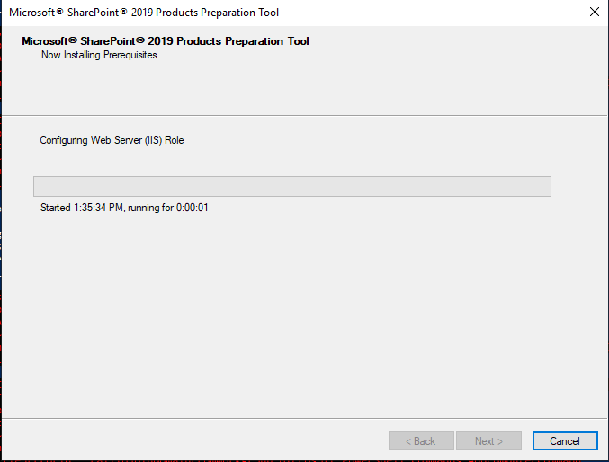

# Windows Server II - Deployment

Deze handleiding beschrijft het proces om Windows Server VMs automatisch aan te maken en configureren met behulp van het `unattended_install` script.

## Vereisten

Zorg ervoor dat je alle benodigde bestanden hebt van [Academic Software](https://portal.academicsoftware.com/):

-   Windows Server 2019 ISO
-   Windows 10 Education ISO
-   VirtualBox Guest Additions ISO
-   SharePoint Server 2019 image
-   Microsoft SQL Server ISO
-   SQL Server Management Studio

## Unattended Install

### 1.  Download ISO bestanden

Download het Windows Server ISO-bestand en het VirtualBox Guest Additions ISO-bestand en plaats ze op een toegankelijke locatie op de hostmachine.

### 2. Bewerk `.env` bestand

Maak een `.env`-bestand aan in de `src`-map en vul de volgende variabelen in:

**Opmerking**: Onderstaande configuratie is een voorbeeld voor de machine `QuantumToast`.

```console
# QuantumToast VM Configuration

VM_NAME="QuantumToast"                      # Andere servers: TofuTerminator, TurboTaco
USER_NAME="toaster"                         # Andere gebuikersnamen: terminator, taco
USER_PASSWORD="Friday13th!"

ISO_PATH="/home/anton/isos/en_windows_server_2019_x64_dvd_4cb967d8.iso"
GUEST_ADDITION_ISO_PATH="/home/anton/isos/VBoxGuestAdditions_7.0.6.iso"

CPUS="2"
MEMORY="2048"
DISK_SIZE="50000"
GUI="1"
```

**Opmerking**: Je kan de GUI parameter in het `.env` bestand aanpassen om te bepalen of de VM een desktopomgeving moet hebben (`GUI="1"`) of niet (`GUI="0"`).

**Opmerking**: Raadpleeg `1_documentatie.pdf` om de vereiste specificaties van de machines te bekijken.

### 3. Uitvoeren `unattended_install.sh`

Dit script zal een nieuwe VM aanmaken en configureren met behulp van de variabelen in het `.env` bestand.

```console
$ cd src/
$ ./unattended_install.sh
```

## Provisioning QuantumToast Server

Na het succesvol aanmaken van de QuantumToast VM, moet je de machine voorzien van de benodigde configuraties en software door de volgende stappen uit te voeren.

Zorg ervoor dat de execution policy van PowerShell is ingesteld op `unrestricted`:


```console
PS1> Set-ExecutionPolicy -ExecutionPolicy unrestricted -Force
```

### 1. Navigeer naar de Provision Directory:

Navigeer naar de `Z`-schijf van de VM en vervolgens naar de overeenkomstige map, in dit geval `quantum_toast`.
Dit is een gedeelde map die rechtstreeks is gekoppeld aan de map `provision` op de hostmachine.

```console
PS1> cd Z:\quantum_toast\
```

### 2. Uitvoeren `1_quantum_toast.ps1`

Voer het eerste provisioning script uit:

```console
PS1> .\1_quantum_toast.ps1
```

Dit script zal de NAT-interface configureren, de rol van de domeincontroller installeren en de Active Directory-forestrol instellen.
De machine zal automatisch opnieuw opstarten om de wijzigingen toe te passen.

**Opmerking**: Zorg ervoor dat je de scripts uitvoert met administratieve privileges.

### 3. Herhaal de Stappen na de Reboot:

Je wordt automatisch ingelogd als de gebruiker `toaster`, die niet gemachtigd is om het tweede script uit te voeren.
Log uit bij Windows en log opnieuw in als domeinbeheerder met de volgende gegevens:

-   Gebruikersnaam: `WS2-2324-ANTON\Administrator`
-   Wachtwoord: `Friday13th!`

Na de herstart herhaal je dezelfde stappen en navigeer je naar `Z:\quantum_toast\`:

```console
PS1> cd Z:\quantum_toast\
```

### 4. Uitvoeren `2_quantum_toast.ps1`

Voer het tweede provisioning script uit:

```console
PS1> .\2_quantum_toast.ps1
```

Het tweede script zal de volgende configuraties uitvoeren:

-   DHCP Server rol configureren en installeren
-   De Primaire DNS server configureren als forwarder naar `8.8.8.8`
-   Een Certificate Authority opzetten binnen het domein
-   Drie gebruikers aanmaken binnen het domein:
    -   Gebruikesnamen: `antonva`, `johnnyd` en `tessat`
    -   Wachtwoord: `Firday13th!`

**Opmerking**: Zorg ervoor dat je de scripts uitvoert met administratieve privileges.

### 5. Herstart de server

Het is aan te raden om de machine te herstarten zodat alle configuratie wijzigingen doorgevoerd kunnen worden.

```console
PS1> shutdown /r /t 0
```

## Provisioning TofuTerminator Server

Na het succesvol aanmaken van de TofuTerminator VM, moet je de machine voorzien van de benodigde configuraties en software door de volgende stappen uit te voeren.
Deze machine zal worden gebruikt als secundaire DNS-server, in combinatie met SQL Server voor de SharePoint-database.

### 1. Vervang de Windows Server ISO met die van SQL Server

Nadat de installatie van Windows Server is voltooid, moet je de Windows Server ISO vervangen met die van SQL Server.
Dit kan je doen door in VirtualBox onder het `storage` tabblad van de VM de ISO te vervangen.
Dit mag gerust gedaan worden terwijl de machine draaiende is.

Vervang:


Door:


### 2. Navigeer naar de Provision Directory:

Navigeer naar de `Z`-schijf van de VM en vervolgens naar de overeenkomstige map, in dit geval `tofu_terminator`.
Dit is een gedeelde map die rechtstreeks is gekoppeld aan de map `provision` op de hostmachine.

```console
PS1> cd Z:\tofu_terminator\
```

### 3. Uitvoeren `1_tofu_terminator.ps1`

Voer het eerste provisioning script uit:

```console
PS1> .\1_tofu_terminator.ps1
```

Dit script zal initiële configuraties uitvoeren, waaronder:
-   Netwek configuratie (statisch IP adres, DNS server, ...)
-   Joinen van het `WS2-2324-ANTON.hogent` domein
-   Secundaire DNS rol installeren
-   SQL Server installeren
-   Firewall regels aanpassen voor inkomend verkeer naar de databank

Opmerking: Zorg ervoor dat je de scripts uitvoert met administratieve privileges.

### 4. Herstart de server

Om alle configuratiewijzigingen toe te passen, wordt aanbevolen om de machine opnieuw op te starten.

```console
PS1> shutdown /r /t 0
```

## Provisioning TurboTaco Server

Na het succesvol aanmaken van de TurboTaco VM, moet je de machine voorzien van de benodigde configuraties en software door de volgende stappen uit te voeren.
Deze machine zal worden gebruikt als SharePoint Server 2019.

Zorg ervoor dat de execution policy van PowerShell is ingesteld op `unrestricted`:

```console
PS1> Set-ExecutionPolicy -ExecutionPolicy unrestricted -Force
```

### 1. Plaats `officeserver.img` in `src/provision/`

Voordat we TurboTaco kunnen configureren, moet de `officeserver`-image verkregen op Academic Software in de map `src/provision/` worden geplaatst.

De `src` folder zal er als volgt uitzien:

```
src
├── provision
│  ├── officeserver.img
│  ├── quantum_toast
│  ├── tofu_terminator
│  └── turbo_taco
└── unattended_install.sh
```

### 2. Mount de `officeserver.img` image

Vervolgens moet de image binnen de VM worden gemount.
Doe dit door in Windows Explorer de image naar de `C`-schijf te kopiëren en vervolgens te mounten door dubbel te klikken op de image.

Dit zal de image mounten op de `F` schijf van de VM.

### 3. Navigeer naar de Provision Directory:

Navigeer naar de `Z`-schijf van de VM en vervolgens naar de overeenkomstige map, in dit geval `turbo_taco`.

```console
PS1> cd Z:\turbo_taco\
```

### 4. Voer `1_turbo_taco.ps1` uit

Nu is het tijd om het eerste provisioning script uit te voeren:

```console
PS1> .\1_turbo_taco.ps1
```

Dit script zal initiële configuraties uitvoeren, waaronder:
-    Netwerkconfiguratie (statisch IP-adres, DNS-server, ...)
-    Toetreden tot het domein `WS2-2324-ANTON.hogent`
-    Installatie van afhankelijkheden van SharePoint Server 2019
-    Installeren van SharePoint Server 2019
-    Maken van een Server Farm voor de SharePoint-instantie
-    Aanpassen van firewallregels voor netwerkverkeer naar de SharePoint-instantie
-    Maken van een SharePoint-webtoepassing
-    Maken van een SharePoint-server sitecollectie

Volg de stappen zoals beschreven in de volgende afbeeldingen:

Om de installatie van de prerequisites te starten, klik op `Next`:


Aanvaard de licentieovereenkomst en klik op `Next`:


Dit zal de installatie van de prerequisites starten, dit kan enkele minuten duren:



Als alles goed is gegaan zal de installatie succesvol zijn, klik op `Finish`:


Het script zal nu de VM herstarten.

### 5. Voer `2_turbo_taco.ps1` uit

Eens de VM opnieuw is opgestart, log in als de gebruiker `WS2-2324-ANTON\Administrator` met het wachtwoord `Friday13th!`.

Voer stap 2 en 3 opnieuw uit, maar deze keer voor het tweede provisioning script:

```console
PS1> cd Z:\turbo_taco\
PS1> .\2_turbo_taco.ps1
```

Dit zal de installatie van SharePoint Server 2019 starten, volg de stappen zoals beschreven in de volgende afbeeldingen:

Het zal een venster openen, klik op `Install SharePoint Server`:


Vervolgens zal er gevraagd worden om een product key, vul de volgende product key in:
-   Standard trial product key: `XNPCY-7K9B8-Y63P8-82MVM-39P2H`


Accepteer de licentieovereenkomst en klik op `Continue`:


Klik op `Install Now`:


Dit zal de installatie van SharePoint Server 2019 starten, dit kan enkele minuten duren:


Zorg ervoor dat de optie `Run the SharePoint Products Configuration Wizard now` niet aangevinkt is en klik op `Close`:


Herstart de vm door op `Yes` te klikken:


### 6. Uitvoeren `3_turbo_taco.ps1`

Na het herstarten van de VM, log in als de gebruiker `WS2-2324-ANTON\Administrator` met het wachtwoord `Friday13th!`.

Open vervolgens een `SharePoint 2019 Management Shell` met administratieve privileges, en voor het derde provisioning script uit:

```console
PS1> cd Z:\turbo_taco\
PS1> .\3_turbo_taco.ps1
```

Dit script zal een SharePoint site aanmaken, dit kan enkele minuten duren.
